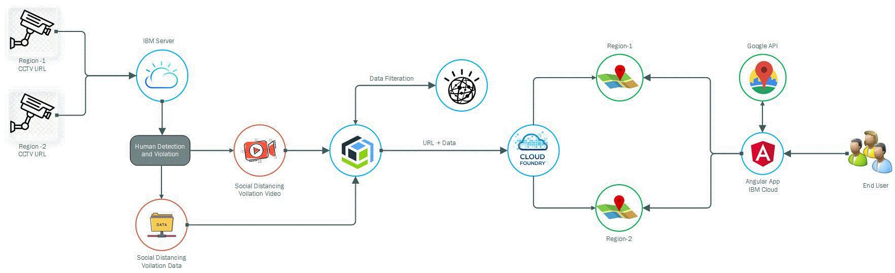
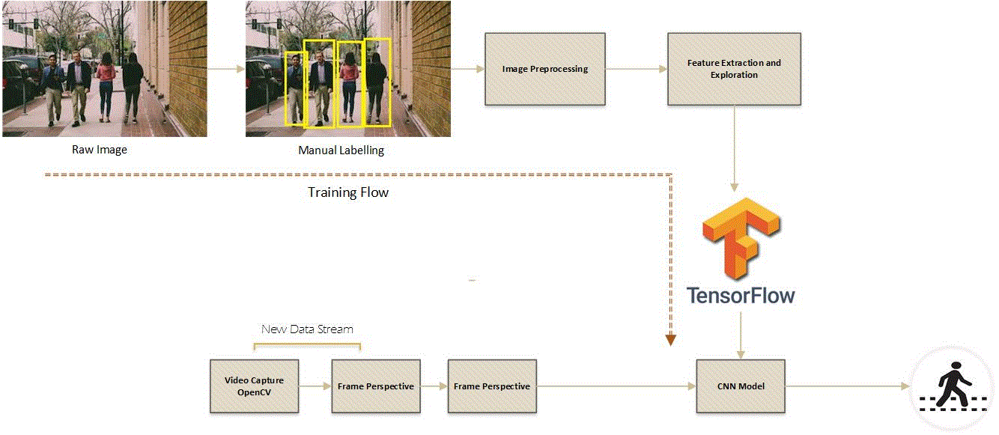
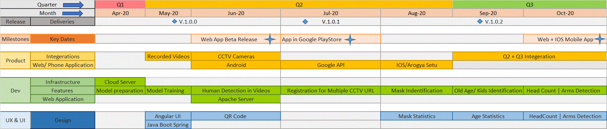
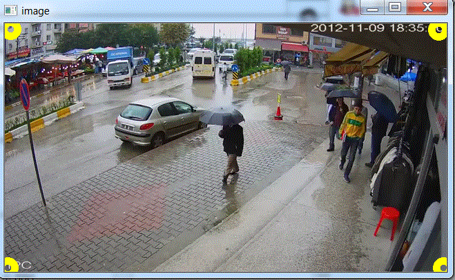
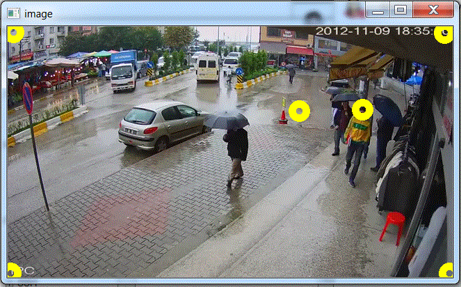
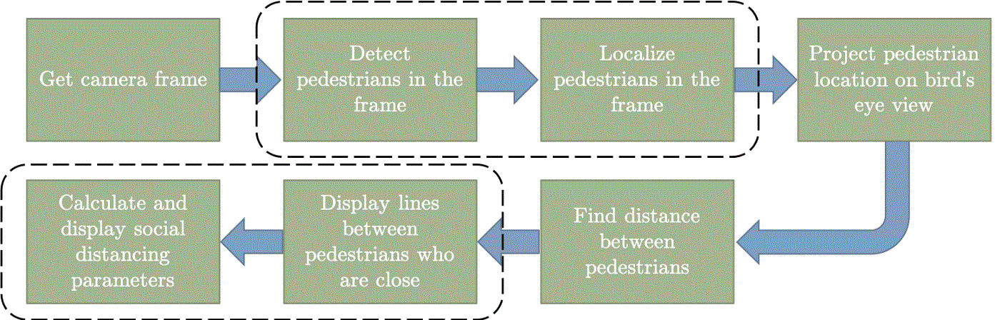

# AI QuaranTeams 

## Contents
1. [Short description](#short-description)
1. [Demo video](#demo-video)
1. [The architecture](#the-architecture)
1. [Long description](#long-description)
1. [Project roadmap](#project-roadmap)
1. [Getting started](#getting-started)
1. [Live demo](#live-demo)
1. [Built with](#built-with)
1. [Versioning](#versioning)

## Short Description
Efficient Solution to monitor Social Distancing and take corrective measures

### What's the problem?

Covid 19 Pandemic has bring up to everyone's  notice that how much social distancing is mandatory. We can still see the increasing number of cases in every state/Country due to negligence of Social Distancing Practices.It is hard to deploy large forces to monitor each area manually for a longer duration

### How can technology help?

We can help to simply the job for all rescue team deployed for ensuring the social distancing in an area. Restricted movements can be allowed in Schools, Colleges , Manufacturing Industries ,Public and Private Sectors Workplace

### The idea

Our Solution can be deployed to all the area under CCTV Scrutiny , where CCTV feed will be used to find the social distancing voilations happening with in the area. The data obtained from CCTV feed can be used to notify the Local Administrator about the current situation of the region and take the necessary actions.

## Demo video

## The architecture
The Diagram shows the High Level Design 

The Diagram shows the Human Detection Process

## Long Description
AI Quarateams in a complete solution for capturing social distancing violation happening in an area . This can be teamed up to find the voilations happening in other areas and get the cummulative data .Based on the alarming situation in each area their respective Local Administrators can be informed using a Text Message/Email Services . We can compare the statistics of different areas and figure out which region needs more attention based on the active cases and new violations happening .
Solution can be described in 3 Sections 

### Section -1 
Model for Object Detection, where Camera feed will be an input to the model for detection of  voilations based on the distance set by the user as a minimun required  distance .
The data will be analysed per frame and can be stored in central server/repository.
The Model is based on python tensor flow neural networks . Model has been trained by providing various images and manually labelling the images to differentiate between human and other objects.For object detection in a video feed , openCv has been used to get the camera perspective and perspective transformation for finding the minimum distance required for social distancing.We are using condense matrix implementation for identifying the distance between many objects detected within a particular frame.If the distance is less than the threshold value , voilation count increases.

### Section -2 
User Interface

Authorized user can view the data using our website. On Successful user login , google AP will request for the user location and display the user's location data (user location is a default location). Other Regions data can be seen by selecting the location on google map .
Based on the region selection the data will fetched from central server along with the live feed. Statistics of different regions can be compared . For alarming situations SMS/Email can be sent to the designated person.

Mobile App and QR Code 

For Easy Handling QR code and  Android Mobile Application has been created . User can view the voilations on mobile phones .

### Section -3 
Data Filteration 

Raw Data obtained from Section-1 is stored in central server/db/respository . When enduser requests to view the statistics from UI , raw data is fetched for requested location  from central server and  cummulative data is prepared using Global API's which gives the information about the current cases within the requested area , zone information .

## Project RoadMap
The RoadMap  defines the timelines and Upcoming Features

Features in Model 

    1.HeadCount : Calculating the total head count in the targeted area. Useful for evacuation in Emergency 
    2.Mask Indentification : Identifying the people with Mask 
    3.Old Age/Kids Identification : Identifying old age people and kids 
	
Features in UI 

    1.Support for IOS Application 
	2.Adding the statistics related to total head count, old Age people and kids
    3.Integeration of UI with the third party APP's like Google API, Arogya Setu APP
	

	
## Getting Started 
The instructions can help you to install the project on you local environment

### Prerequisite 

Softwares required 
1. Windows Server
2. Python 3.5 or above 
3. Deploy a windows server 2019 - Please note if Linux is used then make sure linux is installed with desktop 
4. For Linux server enable the X11 Forwarding and gnome 
5. Install Python 3.5 or above 
5. If Pip 20.0 is not available then use get-pip.py 
   and run python get-pip.py

### Clone the repository

git clone https://github.com/deepikagarg01/AI-Quaranteams.git

### Run the project

Steps 
cd AI-Quaranteams
1. pip install –r requirements.txt
2. pip install -q tensorflow==2.0.0-alpha0
3. resolve the dependencies using pip -install
4. pip install imageio
5. pip install ffmpeg
6. pip install imagio-ffmpeg
7. run command python main.py --videopath "VideoPath" --region "Area_Name"
8. output will be a CSV File and .mp4 video .mp4 for bird eye view

Running main.py will open a window of the first frame in the video. At this point the code expects the user to mark 6 points by clicking appropriate positions on the frame.

#### First 4 points:
The first 4 among the 6 required points are used to mark the Region of Interest (ROI) where you want to monitor. Moreover, the lines marked by these points should be parallel lines in real world as seen from above. For example these lines could be the curbs of the road.
These 4 points need to be provided in a pre-defined order which is following.

* __Point1 (bl)__: Bottom left
* __Point2 (br)__: Bottom right
* __Point3 (tl)__: Top left
* __Point4 (tr)__: Top right

#### Last 2 points:
The last two points are used to mark two points 6 feet apart in the region of interest. For example this could be a person's height (easier to mark on the frame)

#### Plot points
The gif below will help understand the points better

How does it work?
The complete block diagram of the algorithm can be seen below.

## Built with

* [IBM Cloudant](https://cloud.ibm.com/catalog?search=cloudant#search_results) - Cloud Server
* [IBM Cloud Foundary](https://www.cloudfoundry.org/the-foundry/ibm-cloud-foundry) - DashBoard Creation 
* [IBM Angular API](https://www.ibm.com/cloud/blog/simple-angular-node-application) - The web framework used
* [IBM Watson Studio](https://eu-gb.dataplatform.cloud.ibm.com/home?context=wdp&apps=data_science_experience&nocache=true)-Data Preparation

## Versioning

We use gitlab for versioning. 

## Authors
See also the list of [contributors](https://github.com/deepikagarg01/AI-Quaranteams/graphs/contributors) who participated in this project.

